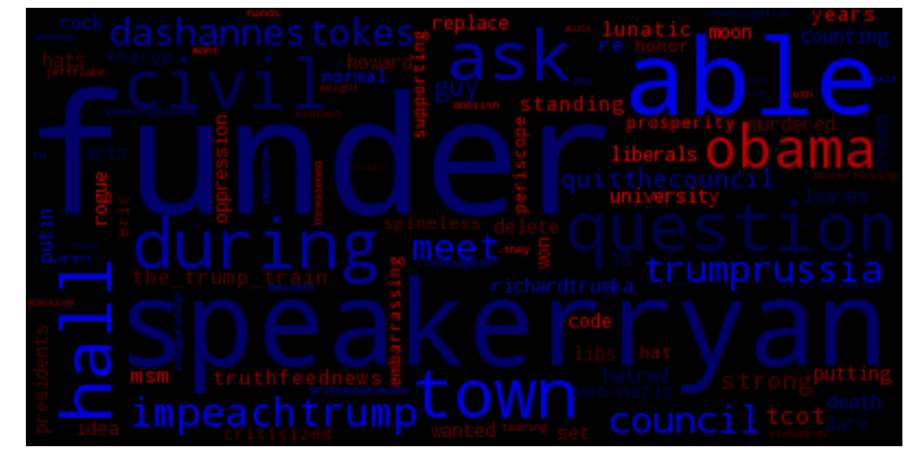

•	Constructed a dataset using the Tweepy API that gathered tweets from opposing political hashtags (maga and resist).  
•	Created a classifier to predict each class and visualized the most informative features (or words) with a word cloud.

 